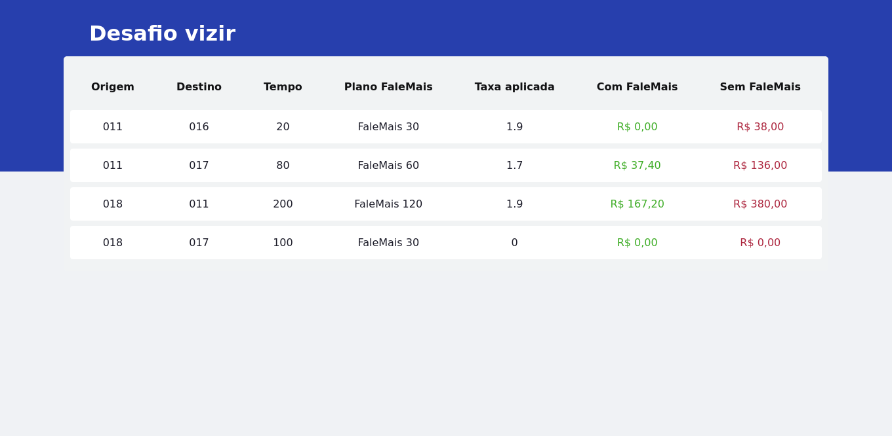

# :rocket: Desafio Vizir

<p align="center">Desafio proposto pela empresa <a href="https://vizir.com.br/">Vizir</a>. Ele consiste em demonstrar aos clientes as vantagens de se utilizar os serviços FaleMais da empresa Telzir.</p>

---

### :link: Deploy

<p>
	Para acessar o deploy da aplicação na plataforma da <a href="https://vercel.com/">Vercel</a>, visite
	<a href="https://murilosilva-desafio-vizir.vercel.app/">https://murilosilva-desafio-vizir.vercel.app/</a>
</p>

---

### :gear: Pré-requisitos

Antes de começar, você vai precisar ter instalado em sua máquina as seguintes ferramentas:
[Git](https://git-scm.com), [Node.js](https://nodejs.org/en/). 
Além disto é bom ter um editor para trabalhar com o código como [VSCode](https://code.visualstudio.com/)

---

### :hammer: Funcionalidades

- [x] Criação e busca em uma API
- [x] Utilização de estados e propriedades
- [x] Utilização do SASS

---

### :framed_picture: Screenshots

<p align="center">
	
</p>

---

### :rocket: Executando a aplicação

#### Clone do repositório

```shell
$ git clone <https://github.com/murilojssilva/01-desafio-ignite>
```

#### Instale as dependêmcias

```shell
$ yarn
```

#### Execute a aplicação em modo de desenvolvimento

```shell
$ yarn dev
```

#### A aplicação iniciará na porta:3002 - acesse <http://localhost:3002>

---

### :computer: Tecnologias

As seguintes ferramentas foram usadas na construção da aplicação:

- [React](https://pt-br.reactjs.org/)
- [TypeScript](https://www.typescriptlang.org/)
- [Vercel](https://vercel.com/)
- [NextJS](https://nextjs.org/)
---

<h4 align="center">Feito com :black_heart: por <a href="https://github.com/murilojssilva">Murilo</a></h4>